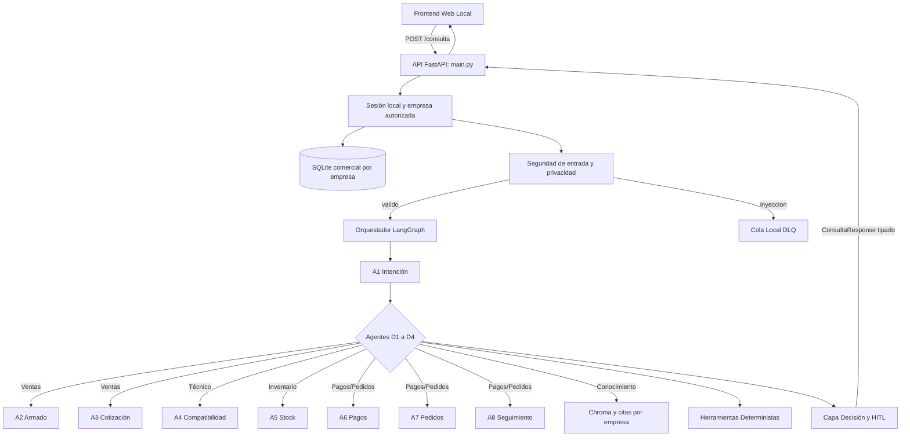

# Veltri Tecnologic

Plataforma local para que empresas del sector informático atiendan consultas, coticen en soles,
validen compatibilidad y stock y registren borradores de demostración con revisión humana.

## Estado y alcance

Veltri Tecnologic, Andina Componentes y Pacífico PC usan la misma aplicación con catálogos,
precios, inventarios, políticas, cuentas y operaciones separados. La interfaz requiere una
sesión local y permite seleccionar las empresas autorizadas. La demo inicial conserva el
catálogo sintético de Veltri.

`POST /consulta` mantiene el contrato `ConsultaResponse`. `GET /catalogo` devuelve el
catálogo del ámbito autorizado. Las demostraciones de LCEL, HITL nativo y Deep Agents se
ejecutan por separado con MockLLM. La [arquitectura](docs/arquitectura.md) documenta la
plataforma, las demos y las evidencias históricas.

## Arquitectura y agentes A1 a A8
Arquitectura por capas implementada en `src/`: orquestador LangGraph (`src/graph/`),
capa de decisión y compuerta HITL (`src/core/`), ocho agentes tipados (`src/agents/`),
almacén de conocimiento RAG (`src/knowledge/`), herramientas deterministas (`src/tools/`),
fachada API FastAPI (`src/api/main.py`) e interfaz web local (`frontend/`).

- **D1 Ventas:** A1 Interpretación de intención, A2 Armado de configuración, A3 Cotización formal.
- **D2 Técnico:** A4 Validación de compatibilidad técnica, TDP, sockets y cuello de botella.
- **D3 Inventario:** A5 Verificación de stock disponible por SKU en almacén.
- **D4 Pedidos y Pagos:** A6 Comparación de importes, A7 Registro de borradores idempotentes, A8 Seguimiento de pedidos.


```mermaid
flowchart TD
    UI[Frontend Web Local] -->|POST /consulta| API[API FastAPI: main.py]
    API --> SES[Sesión local y empresa autorizada]
    SES --> DB[(SQLite comercial por empresa)]
    SES --> SEG[Seguridad de entrada y privacidad]
    SEG -->|valido| ORQ[Orquestador LangGraph]
    SEG -->|inyeccion| DLQ[Cola Local DLQ]
    ORQ --> A1[A1 Intención]
    A1 --> DOM{Agentes D1 a D4}
    DOM -->|Ventas| A2[A2 Armado] & A3[A3 Cotización]
    DOM -->|Técnico| A4[A4 Compatibilidad]
    DOM -->|Inventario| A5[A5 Stock]
    DOM -->|Pagos/Pedidos| A6[A6 Pagos] & A7[A7 Pedidos] & A8[A8 Seguimiento]
    DOM -->|Conocimiento| RAG[Chroma y citas por empresa]
    DOM --> HER[Herramientas Deterministas]
    DOM --> DEC[Capa Decisión y HITL]
    DEC -->|ConsultaResponse tipado| API
    API --> UI
```

## HITL y casos CP-1 a CP-7
Stock agotado, pago discordante, incompatibilidad de socket y exceso de presupuesto exigen
revisión humana obligatoria (HITL). Las probabilidades o confianza alta del LLM nunca conceden
autorización. Los siete casos dorados (`evals/casos_dorados.json`) están integrados y verificados
mediante pruebas de flujo y API con los fixtures históricos. Los precios y existencias de otras
empresas pueden producir resultados distintos.
- **CP-1:** Cotización gaming sintética dentro del presupuesto.
- **CP-2:** Inyección de prompt bloqueada y registrada en DLQ.
- **CP-3:** Ryzen 5 5500 sin stock; revisión y alternativas.
- **CP-4:** Presupuesto insuficiente para la configuración solicitada.
- **CP-5:** Pago discrepante; revisión humana, sin conciliación bancaria real.
- **CP-6:** Borradores idempotentes mediante SHA-256.
- **CP-7:** Armador determinista por rangos de presupuesto.


## Instalación y operación local

Perfil nativo con **CPython 3.14 x64**, navegador y Git para trabajar con el repositorio.
Los comandos usan el intérprete del entorno virtual sin activación.

**Windows (PowerShell)**

```powershell
py -3.14 scripts/veltri_local.py instalar
.\.venv\Scripts\python.exe scripts/veltri_local.py comprobar
.\.venv\Scripts\python.exe scripts/veltri_local.py administrador --usuario admin_local
.\.venv\Scripts\python.exe scripts/veltri_local.py iniciar
```

**Linux**

```sh
python3.14 scripts/veltri_local.py instalar
.venv/bin/python scripts/veltri_local.py comprobar
.venv/bin/python scripts/veltri_local.py administrador --usuario admin_local
.venv/bin/python scripts/veltri_local.py iniciar
```

Abre [Veltri en el navegador local](http://127.0.0.1:8765/). El comando de inicio reserva
loopback y arranca un solo proceso con MockLLM, sin credenciales de proveedores ni configuración `.env`.
Para detenerlo usa **Ctrl+C** en su terminal. Desde otro terminal, usa el mismo intérprete y
ejecuta `scripts/veltri_local.py estado` o `scripts/veltri_local.py detener`.

El comando de administrador se ejecuta una vez, con el servidor detenido y una contraseña
local de al menos 12 caracteres. Ingresa con esa cuenta y selecciona Veltri Tecnologic,
Andina Componentes o Pacífico PC. En **Historial y administración** puedes configurar empresas,
gestionar catálogos y asignar perfiles. La marca, el chat y las operaciones corresponden a la
empresa activa. Se mantienen MockLLM y los pagos y pedidos simulados.

El catálogo comercial, los perfiles, las cotizaciones, los borradores y las revisiones
persisten en SQLite. Chroma se sincroniza desde el catálogo y las políticas de cada empresa.
Para un respaldo local, detén el servidor y copia `chroma_db/plataforma/`.
El modo explícito `iniciar --demo-legada` se conserva para las verificaciones históricas
con datos separados.

Para desarrollar y ejecutar las pruebas, añade `--desarrollo` al comando de instalación.
Luego ejecuta `scripts/verificar.py` e instala el hook con `scripts/instalar_hooks.py`.
Consulta los límites operativos y la propuesta académica en la [arquitectura](docs/arquitectura.md).

## Estructura

| Ruta | Contenido |
|---|---|
| `AGENTS.md` | Invariantes y reglas de desarrollo |
| `src/` | API, grafo, agentes, contratos, herramientas, RAG y demos académicas |
| `frontend/` | Consola web local |
| `data/` | Catálogo, compatibilidad y políticas sintéticas |
| `evals/` | Casos dorados CP-1 a CP-7 y línea base protegida |
| `scripts/` | Verificación, protección, exportación y demos |
| `tests/` | Pruebas unitarias y de integración |
| `docs/` | Arquitectura, Deep Agents, BPMN y registro operativo de LangSmith |
| `.github/workflows/` | Verificación continua en `main` |

## Uso de IA
Codex asistió en la preparación, datos sintéticos, documentación y pruebas.
El equipo debe revisar la entrega y responde por su uso; no se declara revisión
humana ya realizada ni uso de otros asistentes no comprobado.

## Aviso
Precios, stock, fichas y políticas de ejemplo NO son datos reales de la tienda.
Las decisiones propuestas en data/politicas.md requieren aprobación. No usar
este catálogo para vender o prometer compatibilidad de modelos comerciales.
