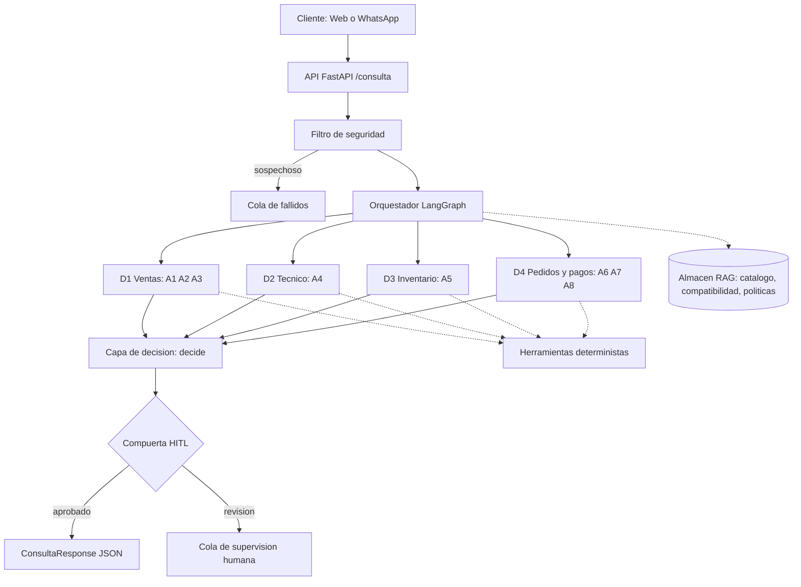

# Arquitectura de Veltri Tecnologic

Diagrama inicial por capas. Se refina a medida que se implementa cada fase.

```mermaid
flowchart TD
    U[Cliente: Web o WhatsApp] --> API[API FastAPI /consulta]
    API --> SEG[Filtro de seguridad]
    SEG -->|sospechoso| DLQ[Cola de fallidos]
    SEG --> ORQ[Orquestador LangGraph]
    ORQ --> D1[D1 Ventas: A1 A2 A3]
    ORQ --> D2[D2 Tecnico: A4]
    ORQ --> D3[D3 Inventario: A5]
    ORQ --> D4[D4 Pedidos y pagos: A6 A7 A8]
    D1 & D2 & D3 & D4 --> DEC[Capa de decision: decide]
    DEC --> HITL{Compuerta HITL}
    HITL -->|aprobado| OUT[ConsultaResponse JSON]
    HITL -->|revision| COLA[Cola de supervision humana]
    ORQ -.-> RAG[(Almacen RAG: catalogo, compatibilidad, politicas)]
    D1 & D2 & D3 & D4 -.-> TOOLS[Herramientas deterministas]
```
